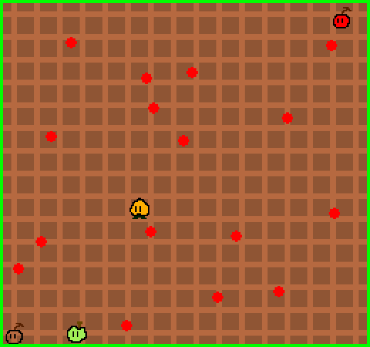

# Cherry Groove

Author: Xinyi Sun

Design: Cherry has lost her color. It needs to find its bright red color back. Do so by collecting the red dots on the map! Remember that collecting is not possible when it's transparent so press space to change to peach's/apple's color to perform valid collection! But beware that changing to these two colors might lead to something risky and colors collected can be lost when peach or apple bumps into you...

Screen Shot:

How Your Asset Pipeline Works:

assets/asset_gen: built from asset_generation.cpp; it first reads the lines from tmp.txt where the file names of the png sources are listed. Then it loads the actual pngs located in the game folder and write them to .asset file as chunk bytes.
dist/game: The game then loads these .asset files and assign palettes and tiles directly to PPU.

How To Play:

Up, down, left, right arrow keys for navigating Cherry on the map. Hit space for changing Cherry's color scheme. When you've collected all red dots, hit space again to turn red and go meet your friend on the upper right corner to win the game! If you want to start again, press space on the winning display.

Sources: All assets created using GIMP by myself. Code references/sources are written in the code files.

This game was built with [NEST](NEST.md).

